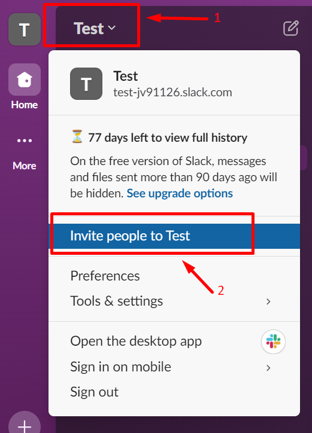

 

## Create Slack Workspace

In this section, we will guide you through creating a new workspace and inviting team members to join.

### Workspace Creation

1. Get started with the [Slack Website](https://slack.com/get-started#/createnew).

2. Enter your email, then click **Continue**.  
    { width="300" }

3. If you are asked to enter a confirmation code, check your email and get the confirmation code sent by Slack, then enter the code to the text field.  
    { width="300"}

4. Click **Create a Workspace**.  
    {width="300"}

5. Follow prompt instructions and enter the required information.

### Workspace Setup  

1. Enter coworkers’ emails or **Skip this step**. (You can invite members later as well)
    { width="400"}

2. Enter a channel name for initiating your first channel, then click **Next**.
    { width="400"}  

3. Click **Start With Free**.  
    {width="400"}

### Member Invitation

1. If you skip inviting members in step 1 of Workspace Setup, on the left, click **YOUR WORKSPACE NAME**, then find "Invite people to YOUR WORKSPACE NAME" and click.  
    {width="300"}

2. In the prompt text box, enter coworkers’ emails. Then click on **Send** to invite them if you manually enter emails. Or, you can choose to share the workspace link to invite members.  
    {width="400"}  

###  Conclusion 

Good job, now, you successfully created a new workspace and you can:

* Invite members into the workspace.  
* Start chats in channels.  

 

See next : **[Project Planning](project_planning.md)**
